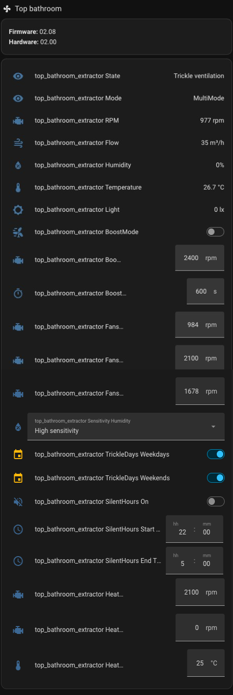
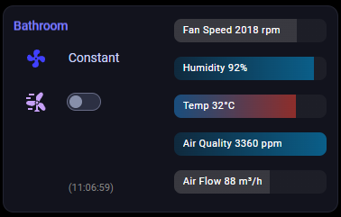
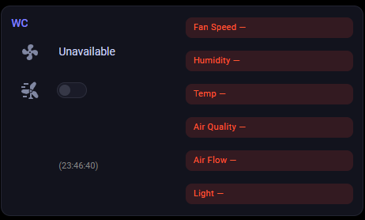
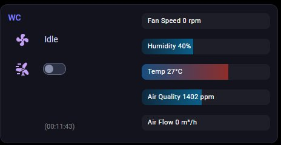

# Home Assistant Custom Component for Pax & Vent-Axia Extractor Fans (Calima BLE protocol)

## Installation

**Recommended (HACS):** Search for **Pax & Vent-Axia BLE** under **HACS → Integrations**.

1. Install [HACS](https://www.hacs.xyz/docs/use/download/download/) if needed, then open **HACS → Integrations**, search **Pax** or **Vent-Axia**, and download.
2. Restart Home Assistant.
3. Go to **Settings → Devices & services → Add integration**, search for **Pax & Vent-Axia Bluetooth**, and follow the prompts.

Manual install: copy the `custom_components/pax_ble` folder into your config `custom_components` directory, restart, then use **Add integration** as above.

Custom HACS repository: You do not need a [custom repository](https://www.hacs.xyz/docs/faq/custom_repositories/) unless you are tracking a fork.

## Supported devices

This integration was originally meant to just support Pax Calima, but as other fans have been made that builds on the same concept, this 
integration now supports:

* Pax Calima
* Pax Levante 50
* Vent-Axia Svara - Calima-compatible (no air-quality sensor); UK units usually advertise as `Vent-Axia Svara`, Nordic Calima as `PAX Calima`
* Vent-Axia Svensa (PureAir Sense model family)

If you've got other fans of the same'ish type, just give it a go and let me know how it works out :)

## Add device

The supported models share the Calima driver. Automatic Bluetooth discovery is configured for **PAX Calima**, **Pax Levante**, and **Vent-Axia Svara**. UK Vent-Axia Svara fans use the last name; Nordic Pax Calima use `PAX Calima`. Same protocol, different BLE local name.

Many Svara units still advertise as `PAX Calima`, in which case discovery may work but the model may show as Calima. Either label uses the same driver - set Svara when adding manually if you prefer the name to match your hardware.

Add via **Settings → Devices & services → Pax & Vent-Axia Bluetooth → Add device**, or enter MAC + model manually if discovery does not appear.

If you have issues connecting, try cycling power on the device. It seems that the Bluetooth interface easily hangs if it's messed around with a bit.

## PIN code

A valid PIN code is required to be able to control the fan. You can add the fan without PIN, but then you'll only be able to read values.
* For Calima/Svara you enter the decimal value printed on the fan motor (remove from base)
* For Svensa, the PIN is not written on the device, but should be requested from it. See [instructions for Svensa](docs/svensa.md).
* For Levante 50, enter pairing mode by powercycling the fan using the switch on the side just before adding the device. The PIN should be discovered automatically. If this fails, see instructions for Svensa.

## Sensor data

The sensors for temp/humidity/light seem to be a bit inaccurate, or I'm not converting them correctly, so don't expect them to be as accurate as from other dedicated sensors.
The humidity sensor will show `unknown` when the reading is too low to convert - roughly below normal indoor humidity.
Airflow is just a conversion of the fan speed based on a linear correlation between those two. This is a bit inaccurate at best, as the true flow will vary greatly depending on how your fan is mounted.

## Good to know
Speed and duration for boostmode are local variables in home assistant, and as such will not influence boostmode from the app. These variables will also be reset to default if you re-add a device.

Configuration parameters are read only on Home Assistant startup, and subsequently once every day, to get any changes made from elsewhere.

Fast scan interval refers to the interval after a write has been made. This allows for quick feedback when the fan is controlled and does not disconnect between reads. This fast interval will remain for 10 reads.

Setting speed to less than 800 RPM might stall the fan, depending on the specific application. I don't know if stalling like this could damage the fan/motor, so do this with care.

### ESP32 bluetooth proxy

If your home assistant instance does not have Bluetooth, you can use a standalone ESP32 with [ESPHome](https://esphome.io/). Use the following ESPHome config to set up the bluetooth proxy:

```yaml
esp32:
  board: esp32dev

bluetooth_proxy:
  active: true

esp32_ble_tracker:
```

When config is applied, go ahead and add the Pax device using HA web GUI.

## Dashboards

### Calima/Svara dashboard metrics example

Example Home Assistant entities card for a Vent-Axia Svara fan, showing the sensors and controls exposed by this integration:

<p align="center">
  
</p>

### Graphical fan card

A compact, tablet-friendly Lovelace card: fan state and a timed Boost toggle on the left, narrow value bars with the reading kept inside each bar on the right. Bars for humidity / air quality / light hide themselves when the matching sensitivity is Off, humidity below the convertible range shows as "Low" rather than a misleading number, and an unavailable fan goes red.

**Written for the Svensa family (including PureAir Sense)** - it references two entities other models do not expose (`sensor.<fan>_air_quality` and `select.<fan>_sensitivity_presence`). Calima / Svara owners need three small substitutions, documented in the file header.

<p align="center">
  
</p>

The decluttering template lives in [docs/lovelace-fan-card.yaml](docs/lovelace-fan-card.yaml) - install notes, required HACS frontend modules (decluttering-card, card-mod, mushroom, template-entity-row) and the full variable list are in the file header.

Unavailable is deliberately loud - a dead fan renders red with no bar fills, and the last-poll clock freezes at the failure time (left: a fan cut off at the mains; right: the same fan minutes after power returned):

<p align="center">
  
  
</p>

## Thanks

- [@PatrickE94](https://github.com/PatrickE94/pycalima) for the Calima driver
- [@MarkoMarjamaa](https://github.com/MarkoMarjamaa/homeassistant-paxcalima) for a good starting point for the HA-implementation
